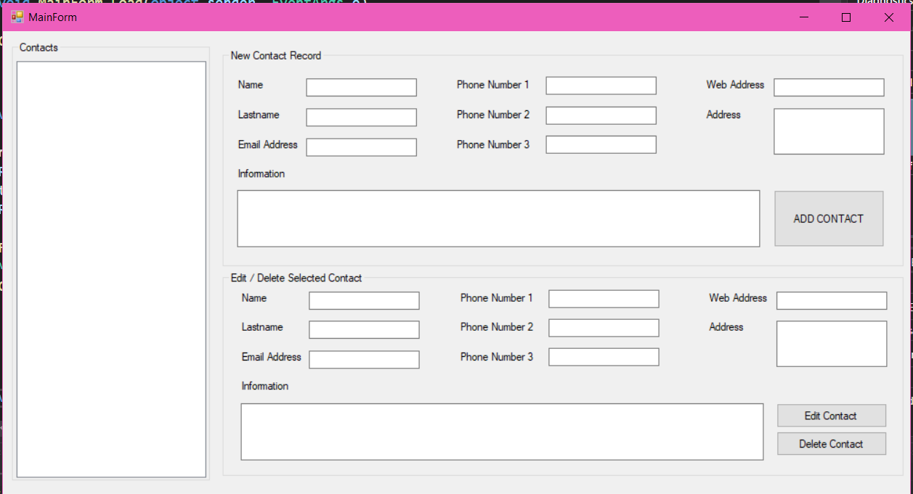
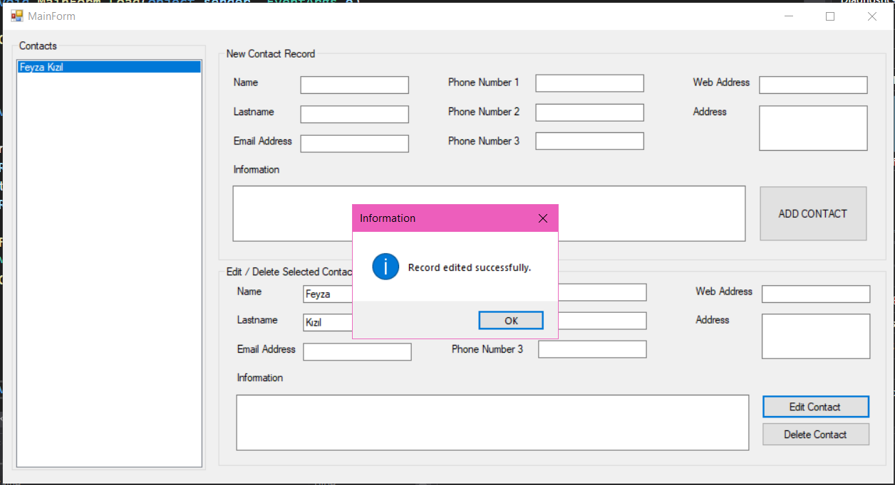

Phone Contacts
=============
**Table of Contents**
#DatabaseLogicLayer Class Library
##DLL Class
#BusinessLogicLayer Class Library
##BLL Class
#Entities Consol Class Library
##myUser Class
##Contacts Class
#PhoneContacts Windows Form App
##UserLoginScreen Form
##MainForm Form
##Program Class
#Sql File

# User Login Screen

# Main Form

# Example

