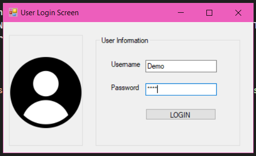

Phone Contacts
=============

# User Login Screen

# Main Form

# Example

# Contents
1- DatabaseLogicLayer Class Library
	*DLL Class
2- BusinessLogicLayer Class Library
	*BLL Class
3- Entities Consol Class Library
	*myUser Class
	*Contacts Class
4- PhoneContacts Windows Form App
	*UserLoginScreen Form
	*MainForm Form
	*Program Class
5- Sql File
